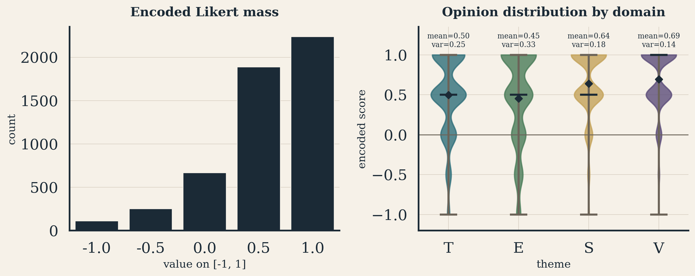
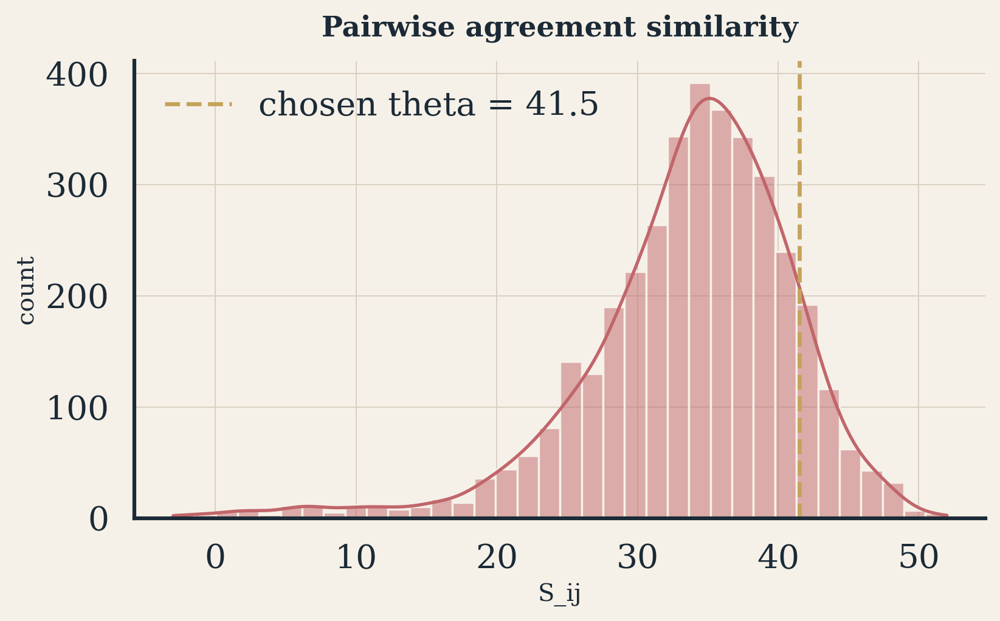
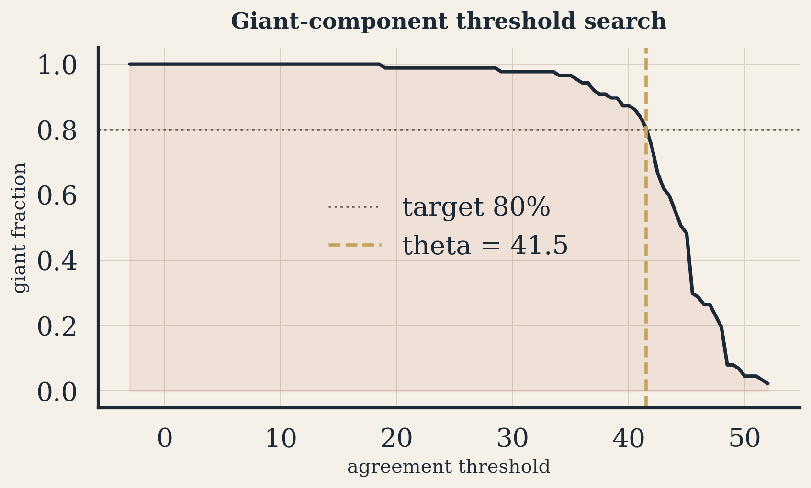
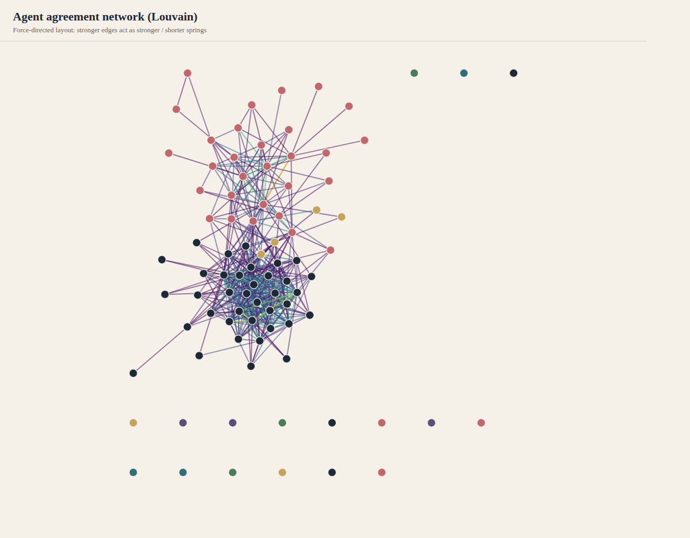
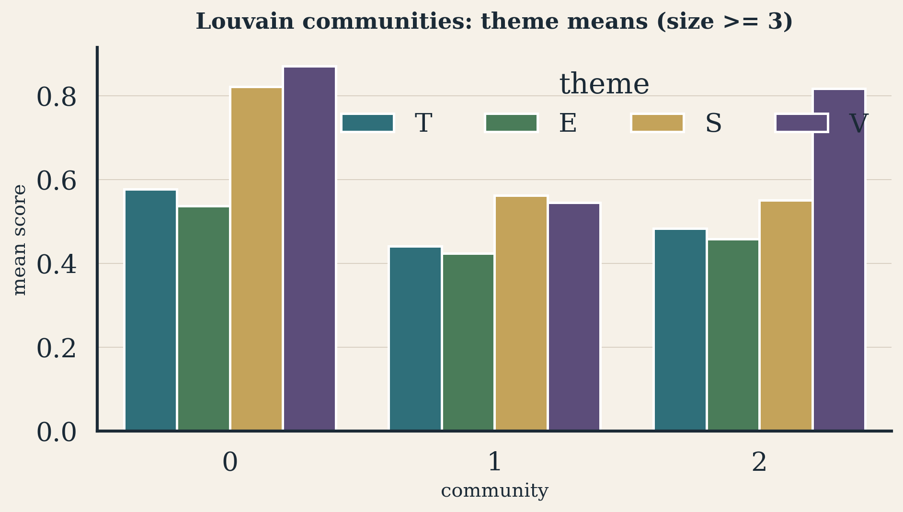
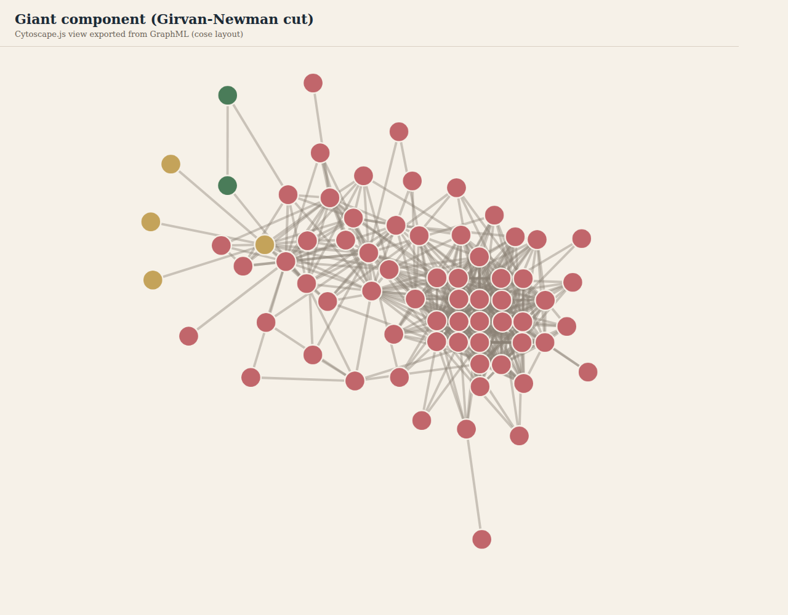
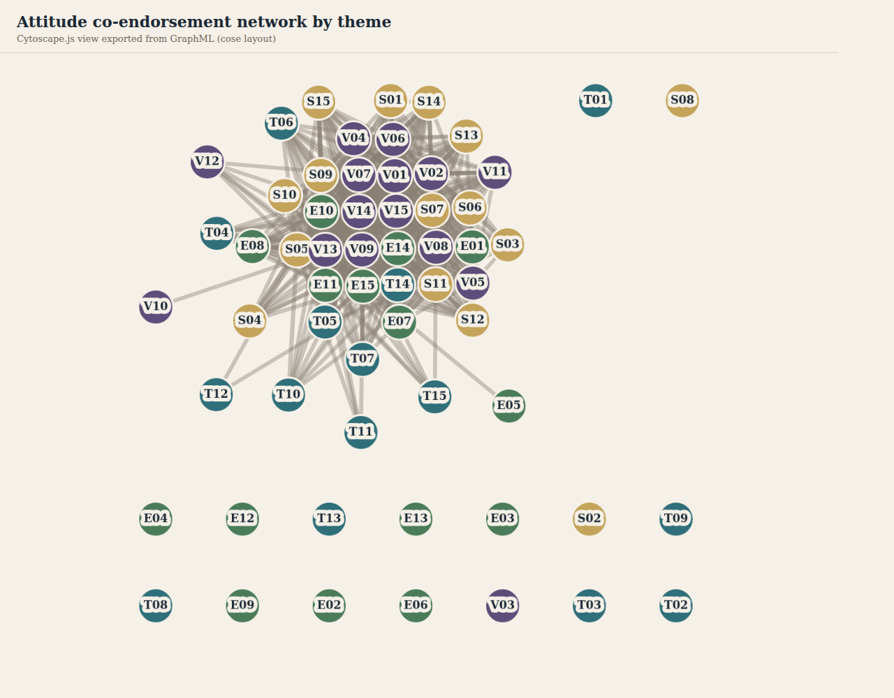
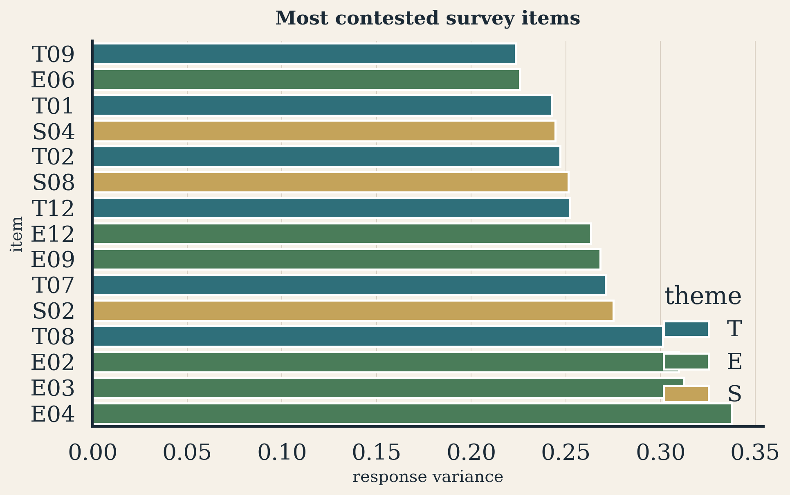
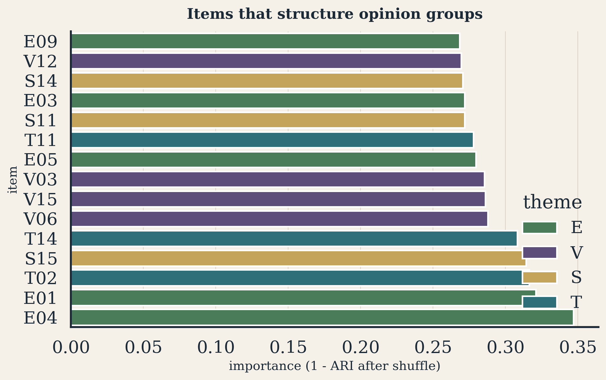

# Team Name

**Team 34**

# GitHub link to your code

[https://github.com/vishakkashyapk30/dpcn-a1-opinion-network-team34](https://github.com/vishakkashyapk30/dpcn-a1-opinion-network-team34)

Source code lives in `code/` (`01_data_and_network.ipynb`, `02_analysis.ipynb`, `regenerate_figures.py`). Figures used below are under `figures/`; interactive Cytoscape views are linked from `figures/cytoscape/index.html`.

# Dataset Documentation

## What the survey measures

The class survey asks every respondent to evaluate **60** statements on a five-point Likert scale, grouped into four thematic blocks of 15 items each:

- **Technology (T):** AI in society, education, work, health, regulation, and data.
- **Education (E):** pedagogy, assessment, attendance, research, and curriculum change.
- **Ethics / Society (S):** responsibility, inclusion, misinformation, trust, and accountability.
- **Environment (V):** climate action, conservation, consumption, and institutional sustainability.

We treat the table as a **bipartite** participant-item structure in the sense of MacCarron et al. (2020): people are connected to statements through their answers, and any person-person or statement-statement network is a *projection* of that underlying survey.

## Preparation choices (and why they matter)

Labels were mapped to $[-1,-0.5,0,0.5,1]$. Blank cells and `No Comments` were coded as missing rather than forced into Neutral, because inventing a midpoint would artificially inflate agreement. Respondents with under **50%** answered items were removed (**87** of **96** retained). Pairwise comparisons required at least **20** overlapping answers so that similarity is not dominated by a handful of shared items.

These choices matter for interpretation. Nine near-empty rows would otherwise look like "extreme disagreement" or create unstable edges. After filtering, the remaining matrix still shows a strong **Agree skew**: most mass sits on $+0.5$ and $+1.0$. Theme means are highest for Environment and Society and lowest for Education. That already hints that fault lines, if any, are more likely in classroom and technology-policy items than in broad pro-sustainability or pro-responsibility statements.

{width=69%}

**Reading this figure.** A mean-only analysis would stop here and conclude "the class is progressive / agreeable." The network approach below asks a different question: *among people who are mostly agreeable, who still clusters with whom, and which items create those clusters?*

# Pipeline Followed

## Conceptual goal

Following MacCarron et al. (2020), Dinkelberg et al. (2021), and the applied framing in Maher et al. (2020), we build an **opinion agreement network**: nodes are respondents; an edge means sufficiently similar answer patterns. This is a *homophily* network of attitudes, not a social-contact network. Edges mean "these two people would recognize each other as opinion-neighbors," not "they interact."

We also build an **attitude network**: nodes are survey statements; edges capture co-endorsement. That projection answers which beliefs travel together in this class.

## Similarity and thresholding

For jointly answered items $F_{ij}$ with $n_{ij}=|F_{ij}|$,

$$
S_{ij}=n_{ij}-\sum_{f\in F_{ij}}|q_{if}-q_{jf}|.
$$

Perfect agreement yields $S_{ij}=n_{ij}$; maximal opposition yields $-n_{ij}$. We keep edges with $S_{ij}\ge\theta$ and lower $\theta$ until a giant component covers about **80%** of respondents (Dinkelberg et al.). The selected value is **$\theta=41.5$** (87 nodes, 456 edges, giant fraction $0.805$).

{width=57%}

{width=57%}

**Why thresholding is substantive, not cosmetic.** Without a threshold the network is nearly complete and communities are meaningless. With too high a threshold the graph shatters into trivia. The 80% giant-component rule is a literature-backed compromise: it retains the backbone of shared opinion while still allowing modular structure to appear.

Attitude edges use co-endorsement $W_{ab}=\sum_i q_{ia}q_{ib}$, keeping strong positive links. Theme-restricted agent networks (T/E/S/V) were exported for robustness checks.

# Analysis and Visualizations

Charts use a custom seaborn theme. Network drawings are Cytoscape.js renders of the GraphML exports (also openable in Cytoscape Desktop). Interactive pages: `figures/cytoscape/index.html`.

## What the agent network looks like

At $\theta=41.5$ the agent graph has density $0.122$, average degree $\approx 10.5$, and clustering $0.45$. The giant component's average path length is about $2.3$: most retained respondents are a short agreement-path from each other. Degree here means "many near-agreements," not social popularity.

{width=75%}

Interactive: `figures/cytoscape/agent_louvain.html`

**Interpretation.** The visualization is not "two hostile camps." It is a **shared core with graded neighborhoods**: two large colored blocs sit adjacent and interlinked, with a thin fringe of weakly attached or isolated nodes. That geometry already anticipates the community statistics below.

## Communities as opinion-based groups

Louvain modularity on the weighted agent graph is moderate ($Q\approx 0.275$). The meaningful mass sits in two large communities (sizes **37** and **29**) plus a small group of four; remaining "communities" are mostly singletons outside the dense core.

Theme-mean profiles clarify *what* separates the large groups:

{width=69%}

**Interpretation.** This is intensity / consistency separation more than issue-by-issue opposition. Community 0 looks like a strongly affirmative consensus bloc. Community 1 agrees in the same direction on average but less forcefully, particularly on S and V. Education remains the lowest theme mean in both, so pedagogy is a shared soft spot rather than a left-right cleavage.

Girvan-Newman on the giant component reinforces the weak-polarization reading: the cut is unbalanced (roughly 64 versus small splinters), unlike the clearer partisan splits reported for ANES examples in MacCarron et al. (2020) and Dinkelberg et al. (2021).

{width=75%}

Interactive: `figures/cytoscape/agent_girvan_newman.html`

## What the attitude network adds

The attitude projection asks which statements co-travel. Dense S/V linkage and a more fragmented E/T periphery appear both in Cytoscape and in the clustermap.

{width=75%}

Interactive: `figures/cytoscape/attitude_themes.html`

**Interpretation.** Respondent communities tell us *who aligns with whom*. The attitude network tells us *which ideas form packages*. In this class, responsibility / trust / sustainability statements form a package; contested classroom and some AI-policy statements do not sit as comfortably in that package. That is exactly where a mean-only dashboard would understate structure: averages look uniformly positive, but co-endorsement topology is not uniform.

## Which items structure the groups?

Contestedness (variance) and structural importance (shuffle disruption) answer related but different questions.

{width=67%}

{width=67%}

**Interpretation.** High variance marks disagreement *content*. High importance marks disagreement that *organizes people*. Overlap on education pedagogy and generative-AI-as-learning-aid is informative: those items are both contested and community-shaping. Some Environment items can be important for modularity even when means are high, because subtle differences still help separate the strongly affirmative bloc from the milder bloc. T14 (algorithms and polarization) matters structurally even though the class largely agrees that polarization is a problem: variation in strength of that belief still tracks community membership.

# Results and Discussion

## What we learned about the survey

1. **Shared affirmative backbone.** After principled filtering and thresholding, most respondents sit in one high-agreement giant component. Broad Society and Environment items are the glue.

2. **Graded, not bipolar, opinion groups.** Louvain finds two large neighborhoods that differ mainly in affirmation intensity. Girvan-Newman does not recover two large opposing factions. Relative to political survey examples in the cited papers, this cohort is weakly polarized.

3. **Education (and some AI-education policy) is the fault line.** Means, variances, attitude periphery, and shuffle importance converge on pedagogy and generative-AI classroom use as the places where opinion-neighbors diverge.

4. **Belief packaging.** Co-endorsement ties show a sustainability/responsibility package distinct from a more fragmented education/technology set. The class does not hold one undifferentiated "progressive" vector; it holds a dense moral-environmental core with looser pedagogical-technical edges.

## How the network approach helped

A spreadsheet of means would correctly report Agree bias and theme averages, but it would miss:

- the **backbone versus fringe** geometry of respondents at a literature-motivated agreement threshold;
- the existence of **two large opinion neighborhoods** with different affirmation intensity;
- the distinction between **contested items** and **community-organizing items**;
- the **co-endorsement packages** among statements that define what "agreeing with the class" actually consists of.

In short, the MacCarron/Dinkelberg pipeline turned a high-dimensional Likert table into relational structure we can visualize (Cytoscape), measure (modularity, giant component, degree), and interrogate (item shuffles). That is what let us move from "students mostly agree" to "students mostly share a societal-environmental core, while education practice and AI-in-learning are the organizing disagreements."

# Individual Contribution

| Member | Contribution |
|:-------|:-------------|
| Kushal Balabhadruni | Dataset documentation, Likert encoding and missingness rules, notebook 01 network construction |
| Rohit Jeswanth | Similarity thresholding, GraphML / theme-slice exports, community detection and item-importance analysis in notebook 02 |
| Vishak Kashyap K | Figure theme and Cytoscape views, report narrative and assembly, repository organization |

# References

1. MacCarron, P., Maher, P. J., and Quayle, M. (2020). Identifying opinion-based groups from survey data: a bipartite network approach. arXiv:2012.11392.
2. Dinkelberg, A., MacCarron, P., Maher, P. J., and Quayle, M. (2021). Detect opinion-based groups and reveal polarisation in survey data. arXiv:2104.14427.
3. Maher, P. J., MacCarron, P., and Quayle, M. (2020). Mapping public health responses with attitude networks: the emergence of opinion-based groups in the UK's early COVID-19 response phase. *British Journal of Social Psychology*.
