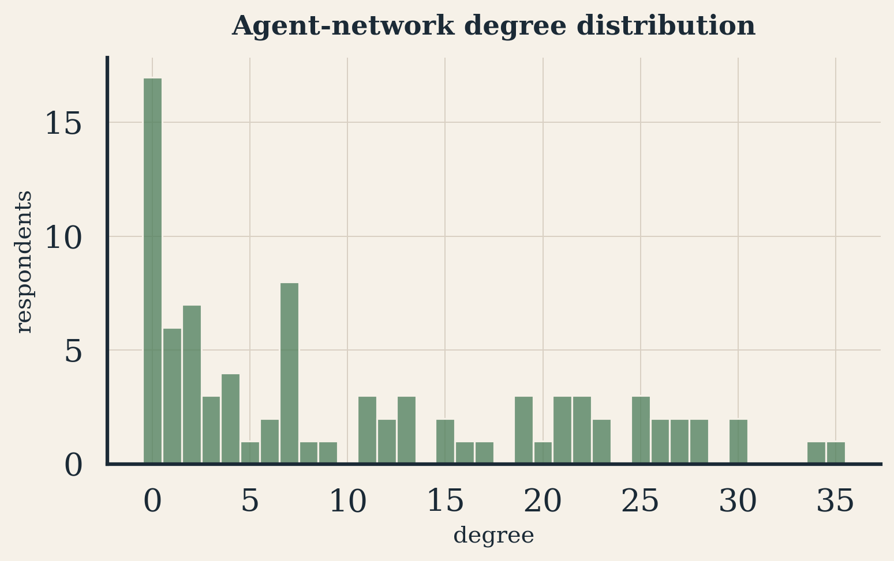
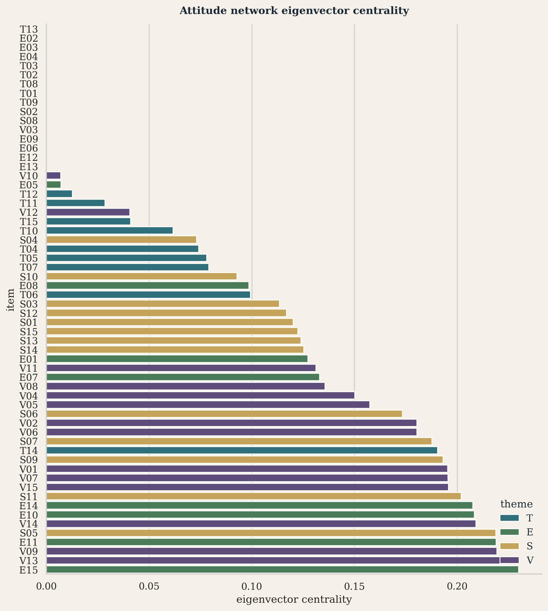

# Team Name

**Team 34**

# GitHub link to your code

[https://github.com/vishakkashyapk30/dpcn-a1-opinion-network-team34](https://github.com/vishakkashyapk30/dpcn-a1-opinion-network-team34)

# Dataset Documentation

Our class survey asks 60 opinion statements, each answered on a five-point
Likert scale: Strongly Disagree, Disagree, Neutral, Agree, Strongly Agree. The 60
statements are grouped into four themes, 15 items each: **Technology (T)**,
**Education (E)**, **Ethics/Society (S)**, and **Environment (V)**. The raw file
has 96 respondents.

We mapped the five labels onto a symmetric number line, so a computer can
compare answers numerically:

| Label | Strongly Disagree | Disagree | Neutral | Agree | Strongly Agree |
|:------|:---:|:---:|:---:|:---:|:---:|
| **Code** | $-1.0$ | $-0.5$ | $0.0$ | $+0.5$ | $+1.0$ |

Blank cells and the literal text "No Comments" were coded as missing, not as
Neutral. Coding a skipped question as Neutral would invent an opinion the
respondent never gave, and it would make two people who both skipped the same
questions look artificially similar later on. We kept only respondents who
answered at least 50% of the 60 items: **87 of 96 kept, 9 dropped**
(ids 30, 39, 44, 60, 68, 73, 77, 78, 87). Missing answers are also not spread
evenly across themes: Technology has the fewest missing cells and Environment
the most, T < E < S < V in order. We return to what that pattern might mean in
the Results and Discussion section.

The whole pipeline treats this table as a **bipartite** structure: respondents
on one side, statements on the other, with a link wherever someone answered a
statement. Squashing away the statements and keeping only respondents gives an
**agent network** (who thinks like whom). Squashing away the respondents and
keeping only statements gives an **attitude network** (which beliefs travel
together). Both are projections of the same underlying survey, following
MacCarron, Maher and Quayle (2020) and Dinkelberg et al. (2021), with applied
framing from Maher, MacCarron and Quayle (2020).

![Encoded response mass and mean stance by theme. Left: how many answers fell at each of the five values on the $[-1,1]$ scale. Right: the average score per theme (0 = perfectly neutral).](../figures/eda_likert_and_themes.png){width=72%}

The left panel shows a clear Agree skew: few respondents pick Strongly Disagree,
progressively more pick Disagree, Neutral, Agree, with Agree and Strongly Agree
the two largest buckets. The right panel shows every theme's mean sits above
zero, with Environment and Ethics/Society highest and Education lowest.

\newpage

# Pipeline Followed

This section explains, step by step and in plain language, every algorithm used
to turn the 87x60 opinion table into the two networks and the analysis on top
of them.

## Step 1: Measuring how similar two respondents are

For any two respondents $i$ and $j$, we only compare them on items both
answered: call that shared set $F_{ij}$, with $n_{ij} = |F_{ij}|$ items in it.
For every shared item $f$, their scores $q_{if}$ and $q_{jf}$ differ by
$|q_{if}-q_{jf}|$, between 0 (identical answer) and 2 (one Strongly Agree, the
other Strongly Disagree). We sum that disagreement across every shared item and
subtract it from the number of shared items:

$$
S_{ij} \;=\; n_{ij} \;-\; \sum_{f \in F_{ij}} |q_{if} - q_{jf}|
$$

Worked example: suppose two people both answered the same 4 items, with scores
$(1.0, 0.5, -0.5, 1.0)$ for person A and $(1.0, 0.0, -1.0, 0.5)$ for person B.
The differences are $0, 0.5, 0.5, 0.5$, summing to $1.5$, so
$S_{ij} = 4 - 1.5 = 2.5$. Perfect agreement on every item would give
$S_{ij}=n_{ij}=4$; exact opposite answers on everything would give $S_{ij}=-4$.
So higher $S_{ij}$ means stronger agreement, and the score is automatically
scaled by how many items the pair actually shares.

We only trust $S_{ij}$ when $n_{ij} \geq 20$, to avoid a similarity score driven
by a handful of shared items. In this dataset that floor never actually binds:
every one of the $\binom{87}{2}=3{,}741$ pairs shares at least 41 of the 60
items, well above 20, because the incompleteness filter had already removed the
very sparse respondents. Across all pairs, $S_{ij}$ ranges from $-3$ to $52$
(mean $33.7$, median $34.5$).

## Step 2: Choosing an agreement threshold

$S_{ij}$ alone gives a complete network: every pair has some score, so drawing
an edge for every pair produces one dense blob with no visible structure. We
only keep edges where $S_{ij} \geq \theta$ for a cutoff $\theta$. Too high a
threshold and only near-perfect agreement survives, shattering the graph into
tiny disconnected pieces. Too low a threshold and almost every pair survives,
making any detected community meaningless.

Following Dinkelberg et al. (2021), we scan $\theta$ downward from the highest
observed similarity and stop where the network's **giant component** (the
single largest group of respondents who can all reach each other through some
chain of surviving edges) covers about 80% of everyone.

{width=58%}

The histogram is roughly bell-shaped, centred a little above 30. The chosen
threshold, $\theta = 41.5$, sits in the right-hand tail, above the 75th
percentile of all pairwise scores ($38.5$). Only the top quarter or so of
agreement pairs survive as edges.

{width=58%}

As $\theta$ decreases, more edges are added and the giant component grows in an
S-shaped curve: near zero when only extreme agreement counts, climbing steeply
through a middle range, then flattening near 1.0. We stop the first time this
curve crosses 80%, at $\theta = 41.5$, a single pre-committed stopping rule
rather than a threshold picked to produce a nice-looking picture.

## Step 3: Building the agent (respondent) network

At $\theta = 41.5$:

| Property | Value | Plain-English meaning |
|:---|---:|:---|
| Nodes | 87 | every kept respondent, including disconnected ones |
| Edges | 456 | pairs whose agreement cleared the bar |
| Density | 0.122 | 12.2% of all possible respondent pairs are connected |
| Average degree | 10.48 | a typical respondent shares a strong-agreement tie with about 10 to 11 others |
| Average clustering | 0.447 | see below |
| Giant component | 70 / 87 nodes (80.5%) | matches our 80% target by construction |
| Avg. shortest path (giant only) | 2.27 | see below |

Average clustering asks: if A agrees strongly with both B and C, do B and C also
agree strongly with each other? A value of $0.447$ is fairly high (a random
graph with the same density would sit near $0.12$), meaning agreement here forms
cohesive little neighbourhoods rather than spreading out evenly. Average
shortest path length asks: inside the giant component, how many agreement-edges
do you need to hop across to connect any two people, on average? At 2.27, most
well-connected respondents are only one or two hops from each other, even though
the graph overall is fairly sparse.

{width=62%}

There is a tall spike of 17 respondents with degree exactly zero: people who
cleared the completeness filter but whose answer pattern did not agree strongly
enough with anyone else to earn an edge at this threshold. The rest of the
distribution spreads broadly from about 1 up to 35, with no small set of
super-connected hubs.

## Step 4: Building the attitude (statement) network

For two statements $a$ and $b$, define a co-endorsement weight

$$
W_{ab} \;=\; \sum_{i} q_{ia}\, q_{ib}
$$

summed over every respondent who answered both. The product of two signed
scores is positive exactly when both point the same way (both agreed, or both
disagreed) and grows with how strongly both were held. Summing over 87
respondents gives, in total, how much the whole class endorses both statements
together. We keep only edges above the 70th percentile of positive $W_{ab}$
values ($W \geq 40.75$):

| Property | Value |
|:---|---:|
| Nodes | 60 (every statement) |
| Edges | 498 |
| Density | 0.281 |
| Average degree | 16.6 |
| Average clustering | 0.606 |
| Giant component | 44 / 60 nodes (73.3%) |
| Avg. shortest path (giant only) | 1.48 |

The attitude network is denser and more tightly clustered than the agent
network (0.606 vs 0.447 clustering), meaning statements that travel together do
so very consistently.

## Step 5: Finding groups with two different algorithms

**Louvain** (bottom-up). Start with every node in its own community. Try moving
each node into a neighbouring community and keep the move if it increases
**modularity**, a score that asks whether edges inside proposed communities are
denser than random chance would predict given each node's degree. Repeat until
no move helps, then collapse each community into a single super-node and repeat
one level up. This is a greedy method built up from individual nodes, not a
top-down split.

Running Louvain (weighted by $S_{ij}$, fixed seed) gives modularity
$Q = 0.275$: real but moderate structure, not sharply separated communities.
There are 20 "communities" in total, but only three have more than one member:
sizes 37, 29, and 4. The other 17 are singletons, and they are exactly the same
17 respondents with zero degree above. Louvain cannot merge a node with no
edges into anyone's group, so it correctly leaves each one alone, a useful
cross-check between two independent calculations.

**Girvan-Newman** (top-down). Start with the whole giant component as one
group. Compute **edge betweenness** for every edge (how many shortest paths
between all other pairs pass through it) and delete the single edge with the
highest betweenness, since it is the most likely bridge holding two regions
together. Recompute and repeat until the graph splits. We stop at the first
meaningful split.

Applied to the 70-node giant component, the first split is 64 / 4 / 2, heavily
lopsided, unlike Louvain's near-even 37/29 split of the whole graph. If the
class held two roughly equal, opposed camps, Girvan-Newman would find a far more
balanced cut. Instead it finds one dominant backbone with a couple of small
splinter groups attached by thin bridges. Together with the moderate Louvain
modularity, both algorithms point the same way: one broad shared core with
graded internal variation, not a class split into two hostile camps.

.](../figures/cytoscape_agent_louvain.png){width=78%}

One dense cluster on the left (size 37) sits directly attached to and
interleaved with a second, looser cluster (size 29), with real edges connecting
individual members across the two, not two floating islands. The size-4
community sits right at the seam. Disconnected singleton respondents are
scattered at the very edges of the frame.

.](../figures/cytoscape_agent_girvan_newman.png){width=78%}

The overwhelming majority of nodes sit inside one dense mass. A very small
number of nodes are tethered to that mass by only one or two long, thin edges,
the small splinter groups Girvan-Newman peeled off first, because those edges
had the highest betweenness. This is a backbone-and-fringe shape, not a
symmetric two-sided divide.

{width=72%}

Both large communities are positive on every theme, so this is not an "agree
vs disagree" split. Community 0 (size 37) sits noticeably higher than Community
1 (size 29) on every theme, especially Ethics/Society and Environment.
Education is the lowest bar in every community, a shared soft spot rather than
a dividing line. The two big communities differ mainly in how strongly and how
consistently they agree, not in what they agree about.

## Step 6: Who is central, and by which definition?

A network has more than one sensible notion of importance. We compute three, on
two different networks.

**Degree centrality (agent network)**, who is a typical opinion-neighbour and
who is an outlier. The 10 highest-degree respondents (ids 114, 67, 104, 55, 49,
110, 83, 61, 94, 105, degrees from 35 down to 26) overlap strongly with a large
fraction of the class. The 17 zero-degree respondents are not all extreme in
their own opinions: their individual mean scores range from $-0.11$ up to
$+0.68$, median around $+0.41$, similar to the class median. Being disconnected
at this threshold reflects an unusual pattern across items more than an
unusually strong or weak overall opinion.

**Eigenvector centrality (attitude network)**, which statements sit at the
well-connected heart of the belief structure. A node's score is high if it
connects to other highly-connected nodes, computed by repeatedly updating each
node's score as the average of its neighbours' scores until it stops changing
(power iteration). Top items: E15 (continuous learning throughout one's
career, 0.230), V13 (companies accountable for environmental impact, 0.225),
V09 (design products for reuse and recycling, 0.219), E11 (update curricula to
match emerging tech, 0.219), S05 (individuals should control their personal
data, 0.219).

{width=68%}

The bottom of this chart, near-zero centrality, is almost entirely Technology
and Education items (T13, E02, E03, E04, T03, T02, T08, T01). The top is
dominated by Environment and Ethics/Society items, with a handful of Education
items (E15, E11, E14, E10) earning their way in through a "modernise the
university" framing rather than a "how should a classroom be run" framing.

**Betweenness centrality (attitude network)**, which statements bridge
otherwise separate parts of the belief structure. A high score means removing
that node would make many other pairs harder to connect through the network.
Top items: T14 (social media algorithms cause polarization, betweenness
0.0452), V13 (0.0301), E15 (0.0245), V07 (protecting biodiversity, 0.0245), S11
(free expression short of harm or discrimination, 0.0212).

V13, E15, V07 and S11 score high on both betweenness and eigenvector
centrality: deeply embedded hubs and bridges at once. T14 is different: its
betweenness is nearly 50% higher than the runner-up, the single most important
bridge in the network, yet its eigenvector score (0.190) is noticeably lower
than the other top-betweenness items. T14, a Technology statement about social
media and polarization, is not itself part of the densely-interconnected core,
but it is the item that most connects the more fragmented Technology side of
the survey to that core.

## Step 7: Which statements organise the class into groups?

Two different questions are easy to conflate: which statements have the most
disagreement (variance), versus which statements, if removed, would most
change who ends up grouped with whom (structural importance).

{width=70%}

Education items dominate the top: E04 (online learning can complement classroom
teaching), E03 (attendance should be compulsory), E02 (exams accurately measure
knowledge), alongside Technology items like T08 (AI-assisted diagnosis) and T07
(robots replacing humans in hazardous jobs). These are statements where the
class is genuinely divided.

For structural importance, we shuffle one item's answers randomly across
respondents, breaking any real relationship between that item and everything
else while keeping its own overall distribution unchanged. We rebuild the
similarity network and Louvain communities on the shuffled data and compare the
new labels to the original using the **Adjusted Rand Index (ARI)**, a score
from about $-1$ to $1$ where $1$ means identical groupings and $0$ means no
better than random labelling. Importance is $1 - \overline{\text{ARI}}$ over
three shuffle repeats: if shuffling an item barely moves the grouping,
importance is low; if it causes the grouping to fall apart, importance is high.

{width=70%}

E04 and E01 top the list, followed by T02 (generative AI as a learning aid),
S15 (public trust in emerging technology), and T14, the same item that was the
top betweenness bridge above, now confirmed independently as one of the items
that most shapes who gets grouped with whom. Several Environment items (V06,
V15, V03) also appear despite Environment's high mean scores: even where most
people lean the same direction, small consistent differences in how strongly
they lean can still separate the two large communities. E04, E03, T08, S02,
E09 and E12 appear on both the variance and the importance lists, doubly
interesting items that are both contested and structurally load-bearing.

## Step 8: What ideas travel together

.](../figures/cytoscape_attitude_themes.png){width=78%}

Environment (purple) and Ethics/Society (gold) nodes sit thick and richly
interconnected in the main mass. Education (green) contributes some core
members too, mostly the "innovation and lifelong learning" items (E10, E11,
E14, E15), but also has members sitting more loosely on the fringe. Technology
(teal) is most often pushed to the edges or cut off from the core entirely.

.](../figures/cytoscape_attitude_by_degree.png){width=78%}

This view makes the core and periphery impossible to miss: a large,
tightly-packed ball of big nodes in the centre-left, mostly gold
(Ethics/Society) and purple (Environment) with a few large green (Education)
nodes woven in, surrounded by many small, completely isolated single dots
(T01, S08, E04, E12, T13, E13, S02, T09, T08, E09, E02, E06, V03, T03, T02).
Every one of those isolated dots is a Technology or Education item. This is the
clearest picture in the report of a "belief packaging" pattern: sustainability
and social-responsibility statements bind tightly into one endorsed package,
while several technology and education statements stand apart from that
package and from each other.

### The twenty most tightly bound pairs of statements

The co-endorsement weight $W_{ab}$ used to build the attitude network gives us
a ranked list of every pair of statements, so we can also ask a very direct
question: out of all $\binom{60}{2}=1{,}770$ possible pairs of statements,
which specific 20 pairs does the class endorse together most strongly?

| Rank | Pair | Weight | Rank | Pair | Weight |
|---:|:---|---:|---:|:---|---:|
| 1 | E11 x E15 | 63.25 | 11 | E11 x S05 | 59.50 |
| 2 | E15 x V13 | 62.00 | 12 | E11 x V09 | 59.50 |
| 3 | E15 x S05 | 61.75 | 13 | V13 x V14 | 59.00 |
| 4 | E14 x E15 | 61.50 | 14 | E11 x V13 | 59.00 |
| 5 | V09 x V13 | 61.25 | 15 | S05 x V09 | 58.50 |
| 6 | E15 x V09 | 61.00 | 16 | E10 x V13 | 58.25 |
| 7 | S05 x V13 | 60.50 | 17 | V09 x V14 | 58.00 |
| 8 | E10 x E15 | 60.50 | 18 | E11 x S11 | 57.75 |
| 9 | E15 x S11 | 60.00 | 19 | E15 x V15 | 57.50 |
| 10 | E15 x V14 | 59.50 | 20 | E10 x V09 | 57.25 |

: E11 update curricula for emerging technology. E15 continuous learning
throughout one's career. E14 university-industry collaboration. E10
prioritize innovation over rote learning. V13 companies accountable for
environmental impact. V09 design products for reuse and recycling. V14
international cooperation on environmental challenges. V15 protect natural
resources for future generations. S05 individuals should control their
personal data. S11 free expression short of harm or discrimination.

Three patterns in this table are worth pulling out on their own.

**E15 is a mega-hub, not just a top item.** It appears in 9 of these 20 pairs,
more than any other statement, and it pairs with items from every one of the
other three themes (E10/E11/E14 in Education, V09/V13/V14/V15 in Environment,
S05/S11 in Ethics/Society). This is the same item that topped the eigenvector
centrality ranking earlier, and this table shows exactly why: "continuous
learning and skill development are essential throughout one's career" is
worded broadly and inoffensively enough that whoever strongly agrees with it
also tends to strongly agree with almost everything else the class broadly
endorses. It functions less like one specific belief and more like a proxy for
general agreeableness, worth keeping in mind whenever E15's high centrality is
quoted elsewhere in this report.

**Not one Technology item appears anywhere in the top 20.** Out of 1,770
possible pairs, the 20 strongest are built entirely out of Education, Ethics/
Society, and Environment items. This is a much sharper version of the
"Technology sits on the periphery" finding from the Cytoscape degree view:
it is not just that some Technology items are weakly connected, it is that
none of them are strong enough to break into the class's twenty tightest
bonds at all.

**Most of the strongest bonds cross themes, not stay within them.** Only 6 of
these 20 pairs connect two items from the same theme (E11 x E15, E14 x E15,
E10 x E15, V09 x V13, V13 x V14, V09 x V14); the other 14, 70% of the list,
link two different themes. The single tightest bonds in this class are not
"people who like one Environment item like other Environment items," they cut
across topic boundaries entirely. A good concrete example is rank 7, S05
("individuals should have greater control over how their personal data are
collected and used") paired with V13 ("companies should be held accountable
for the environmental impacts of their activities"). These two statements
share no obvious subject matter, one is about digital privacy and the other
about corporate environmental harm, yet they are endorsed together almost as
strongly as two items about the exact same topic. The natural reading is that
both are really asking the same underlying question in different clothes:
should powerful institutions (tech platforms, corporations) be held
accountable to individuals and the public. It is also worth noticing that
E11, an Education item, is itself explicitly about technology ("update
curricula more frequently to match emerging technologies"), yet it behaves
like a member of the Ethics/Environment package (pairing with S05, S11, V09,
V13) rather than clustering with the Technology theme it is adjacent to in
subject matter. The T/E/S/V labels describe where a statement sits in the
survey form, not necessarily which latent belief cluster it actually belongs
to.

\newpage

# Analysis and Visualizations

The figures above already carry the bulk of the analysis, step by step,
alongside the algorithms that produced them. Pulling the threads together:

- The agent network shows a shared, moderately agreeable backbone rather than
  two opposed camps: giant component covering 80.5% of respondents, moderate
  Louvain modularity ($Q=0.275$), and a lopsided Girvan-Newman cut (64/4/2).
- The two large Louvain communities differ mainly in intensity of agreement,
  not direction, and Education is the lowest-scoring theme in both.
- The attitude network shows a coherent, tightly co-endorsed core of
  Environment and Ethics/Society statements (plus a few forward-looking
  Education items), with several Technology and classroom-process statements
  sitting on the periphery or fully isolated.
- Response variance and structural-importance rankings both point to
  Education items (E04, E03, E01) and specific Technology items (T02, T14) as
  the statements that most divide, and most organise, opinion-neighbours in
  this class.
- T14 (social media and polarization) is a uniquely important bridge item: by
  far the highest betweenness centrality in the attitude network, while
  several other central items (V13, E15, S05, E11) are important because they
  sit at the well-connected heart of the network rather than acting as
  bridges.

# Results and Discussion

## What we learned about the survey and the class

1. A shared, moderately-agreeable backbone, not two hostile camps. After
   filtering (dropping 9 incomplete respondents) and a literature-motivated
   agreement threshold ($\theta=41.5$, giant component covering 80.5% of
   respondents), most of the class sits in one well-connected agreement
   network. Girvan-Newman's lopsided 64/4/2 split and Louvain's moderate
   modularity ($Q=0.275$) both point away from a bipolar divide.

2. Two large opinion neighbourhoods that differ in intensity, not direction.
   The two big Louvain communities (37 and 29 members) are positive on every
   theme; one is simply more strongly and consistently positive than the
   other, especially on Ethics/Society and Environment. Education is the
   lowest-scoring theme in both, a shared area of muted enthusiasm rather than
   a dividing line.

3. Education, and specific AI-in-education items, are the real fault lines.
   High response variance (E04, E03, E02), high structural importance under
   the shuffle test (E04, E01, T02), and peripheral position in the attitude
   network together point to classroom-practice and generative-AI-in-learning
   statements as where opinion-neighbours genuinely diverge.

4. A coherent "responsible citizen" belief package. The attitude network's
   dense core, visible in the Cytoscape degree view and the eigenvector
   ranking alike, bundles environmental responsibility, social
   responsibility, personal-data control, and a handful of forward-looking
   education statements into one tightly co-endorsed package, distinct from a
   looser set of Technology and classroom-process statements.

5. T14 ("social media algorithms cause polarization") is a uniquely important
   bridge statement, with by far the highest betweenness centrality in the
   attitude network, and independently ranking among the top items in the
   shuffle-based importance test.

## A note on a possible confound

While preparing the data, we noticed that missing answers are not spread
evenly across the four themes: Technology, presented first, has the fewest
missing cells, and Environment, presented last, has the most (see Dataset
Documentation). Environment and Ethics/Society, the two last-presented themes,
are also the two themes with the highest mean scores and the most internally
consistent (least divided) communities.

Both a real-attitude explanation and a survey-fatigue explanation are
consistent with this pattern. Environment and Ethics/Society may simply be
less controversial topics than Technology and Education. It is also possible
that respondents answer less carefully as a long Likert survey goes on, a
well-documented tendency in survey research called satisficing (Krosnick,
1991), which would make the later themes look more uniformly agreeable than
respondents' true opinions. Because item theme and item position are perfectly
tied together in this survey (every Technology item comes before every
Education item, and so on), our existing pipeline cannot fully separate the
two explanations, and we flag this as a limitation rather than a settled
finding: the strength and uniformity of agreement on Environment and
Ethics/Society items should be read with some caution.

## How the network approach helped

A table of column means would have correctly reported the class's overall
Agree skew and theme-by-theme averages. It would have missed the
backbone-versus-fringe geometry of the class at a principled agreement
threshold, the existence of two opinion neighbourhoods differing in intensity
rather than direction, the distinction between an item being contested and an
item being community-organising, and the co-endorsement packaging of
statements into a coherent worldview cluster. The MacCarron/Dinkelberg
pipeline turned a high-dimensional Likert table into relational structure we
could visualise, measure, and interrogate, which is what let us move from "the
class mostly agrees" to a more specific picture: the class shares a broad
societal-and-environmental core, with classroom practice and
generative-AI-in-education as the areas of real, structurally meaningful
disagreement.

\newpage

# Individual Contribution

| Member | Contribution |
|:-------|:-------------|
| Kushal Balabhadruni | Dataset documentation, Likert encoding and missingness rules, notebook 01 network construction |
| Rohit Jeswanth | Similarity thresholding, GraphML / theme-slice exports, community detection and item-importance analysis in notebook 02 |
| Vishak Kashyap K | Figure theme and Cytoscape views, report narrative and assembly, repository organization |

# References

1. MacCarron, P., Maher, P. J., and Quayle, M. (2020). Identifying opinion-based
   groups from survey data: a bipartite network approach. arXiv:2012.11392.
2. Dinkelberg, A., MacCarron, P., Maher, P. J., and Quayle, M. (2021). Detect
   opinion-based groups and reveal polarisation in survey data.
   arXiv:2104.14427.
3. Maher, P. J., MacCarron, P., and Quayle, M. (2020). Mapping public health
   responses with attitude networks: the emergence of opinion-based groups in
   the UK's early COVID-19 response phase. *British Journal of Social
   Psychology*.
4. Krosnick, J. A. (1991). Response strategies for coping with the cognitive
   demands of attitude measures in surveys. *Applied Cognitive Psychology*,
   5(3), 213-236.
